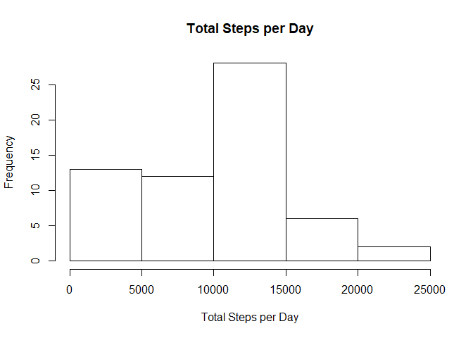
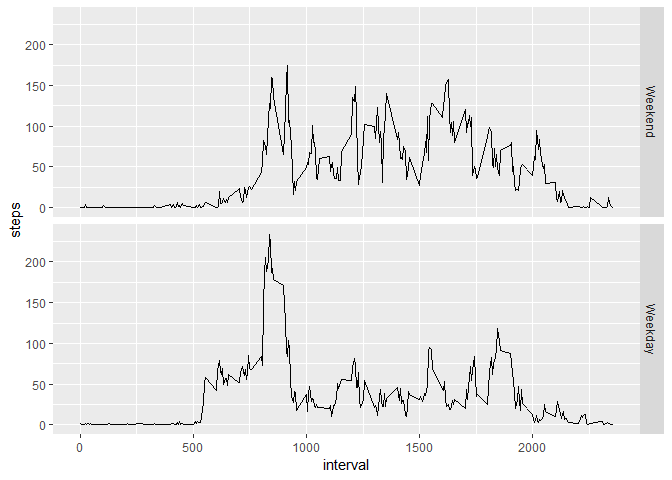

## Loading and preprocessing the data

```r
if(!dir.exists("data")){dir.create("data")}
setwd("./data")
fileURL<-"https://d396qusza40orc.cloudfront.net/repdata%2Fdata%2Factivity.zip"
download.file(fileURL,destfile = "ActivityMonitoring.zip")
unzip("ActivityMonitoring.zip")
library(dplyr)
```

```
## Warning: package 'dplyr' was built under R version 3.5.3
```

```
## 
## Attaching package: 'dplyr'
```

```
## The following objects are masked from 'package:stats':
## 
##     filter, lag
```

```
## The following objects are masked from 'package:base':
## 
##     intersect, setdiff, setequal, union
```

```r
library(ggplot2)
```

```
## Warning: package 'ggplot2' was built under R version 3.5.3
```

```r
activity<-read.csv("activity.csv")
```

## What is mean total number of steps taken per day?

```r
total_steps_per_day<-with(activity,aggregate(steps,list(date),sum,na.rm=TRUE))
mean_total_steps<-mean(total_steps_per_day$x)
mean_total_steps
```

```
## [1] 9354.23
```

## What is the average daily activity pattern?

```r
mean_steps_per_interval<-with(activity,aggregate(steps,list(interval),mean,na.rm=TRUE))
with(mean_steps_per_interval,plot(Group.1,x,type = "l",xlab="Interval", ylab="Average Number of Steps"))
```

<!-- -->

## Imputing missing values
The imputing strategy for missing values is to plug in the total mean steps per interval. The code for this is shown below

```r
new_activity_no_NA<- data.frame(activity)
head(new_activity_no_NA) #Before imputing missing values
```

```
##   steps       date interval
## 1    NA 2012-10-01        0
## 2    NA 2012-10-01        5
## 3    NA 2012-10-01       10
## 4    NA 2012-10-01       15
## 5    NA 2012-10-01       20
## 6    NA 2012-10-01       25
```

```r
na<-which(is.na(activity$steps))
length<-length(na)
na_value<-mean(mean_steps_per_interval$x,na.rm=TRUE)
for(i in length){
  new_activity_no_NA[na,1]<-na_value
}
head(new_activity_no_NA) #After imputing missing values
```

```
##     steps       date interval
## 1 37.3826 2012-10-01        0
## 2 37.3826 2012-10-01        5
## 3 37.3826 2012-10-01       10
## 4 37.3826 2012-10-01       15
## 5 37.3826 2012-10-01       20
## 6 37.3826 2012-10-01       25
```

Median and mean have the same values as compared to the original scenario wherein they were at diferent values

```r
new_total_steps_per_day<-with(new_activity_no_NA,aggregate(steps,list(date),sum,na.rm=TRUE))
mean_total_steps<-mean(new_total_steps_per_day$x)
mean_total_steps
```

```
## [1] 10766.19
```

```r
median_total_steps<-median(new_total_steps_per_day$x)
median_total_steps
```

```
## [1] 10766.19
```

## Are there differences in activity patterns between weekdays and weekends?

```r
weekend<-c("Saturday","Sunday")
activity$weekday<- factor(weekdays(as.Date(activity$date,format="%Y-%m-%d")) %in% weekend, levels=c(TRUE, FALSE), labels=c('Weekend', 'Weekday'))
ggplot(data=activity,aes(x=interval,y=steps))+stat_summary(fun.y=mean,geom="line")+facet_grid(weekday~.)
```

```
## Warning: Removed 2304 rows containing non-finite values (stat_summary).
```

<!-- -->
There are consistently higher number of steps on average per interval during the weekends unlike during the weekdays wherein the number of steps taken peaks then drops. 
